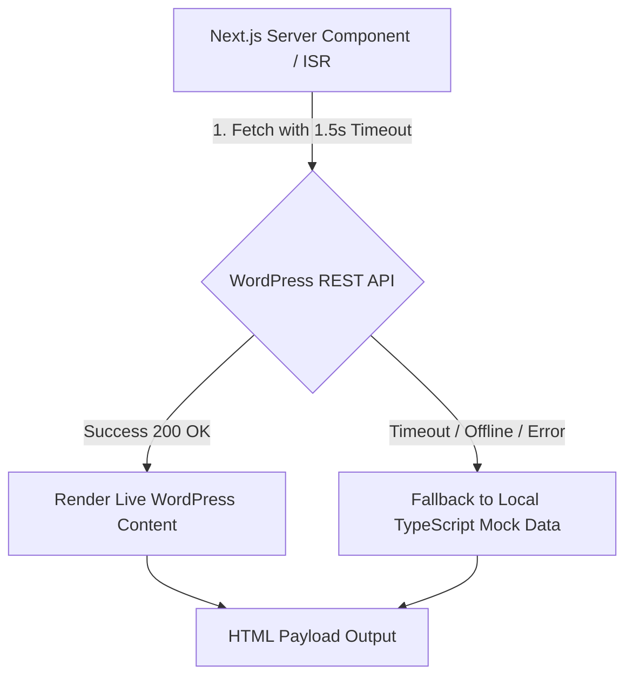

# Comprehensive Project Report: Aether Digital Portfolio System

**Project Name:** Aether Digital Portfolio Platform  
**Architecture:** Next.js App Router + Headless WordPress REST API Integration  
**Framework & Runtime:** Next.js 16 (React 19, TypeScript, Tailwind CSS v4)  
**Date:** August 2026  

---

## 1. Executive Summary

The **Aether Digital Portfolio System** is an enterprise-grade, narrative-driven digital portfolio and technical showcase engineered for high-performance web presentation. Combining the speed, SEO capabilities, and interactive fluidity of **Next.js 16** with the content management power of a **Headless WordPress** backend, the project provides a seamless bridge between modern frontend design aesthetics and effortless backend content management.

Built upon strict **Swiss Design principles**, the platform emphasizes grid alignment, bold editorial typography (Inter), aggressive visual whitespace, subtle glassmorphic elevation, custom WebGL ambient shaders, and fluid micro-interactions.

---

## 2. Key Objectives & Design Philosophy

### 2.1 Design System Blueprint (`DESIGN.md`)
- **Aesthetic Principles:** Inspired by Swiss Design and high-growth SaaS aesthetics (Apple, Vercel, Linear). Focused on high visual hierarchy, blocky typography, and clean, high-contrast layouts.
- **Color Strategy (Monotone-Plus-Accent):**
  - **Surface Background:** `#F8F9FB` / `#FFFFFF`
  - **Primary Text:** `#191C1E` (maximum contrast)
  - **Secondary Text:** `#444748` / `#555555` (body copy & metadata)
  - **Accent Blue:** `#0051D5` / `#2563EB` (focal points, active states, buttons)
  - **Hairline Outlines:** `#E5E7EB` / `#C4C7C7`
- **Typography:** Exclusively powered by **Inter**, leveraging negative letter-spacing for headers and generous line height (1.6) for text readability.
- **Elevation & Depth:** Eliminates heavy skeuomorphic shadows in favor of 1px subtle outlines, tonal layer shifts, and glassmorphic backdrop-blur navigation overlays (`backdrop-blur-md`).

---

## 3. Technology Stack & Key Dependencies

| Layer | Technology | Purpose |
| :--- | :--- | :--- |
| **Frontend Framework** | **Next.js 16 (App Router)** | Server Components, Incremental Static Revalidation (ISR), client routing |
| **UI Library** | **React 19** | Modern UI state management and concurrent component rendering |
| **Language** | **TypeScript 5** | Strict type safety across data interfaces, components, and API routes |
| **Styling Framework** | **Tailwind CSS v4** | Utility-first styling with custom theme definitions and PostCSS processing |
| **Icons** | **Lucide React** | Scalable, vector-based UI icon set |
| **Backend CMS** | **WordPress REST API** | Headless Content Management System for Projects, Services, Testimonials & Blog Posts |
| **Custom WP Theme** | **PHP / `wordpress-theme`** | Native CPT registrations, CORS authorization, and custom mail submission API |
| **Fallback Data Layer** | **Native In-Memory Datasets** | Ensures zero downtime and immediate rendering if the WordPress CMS is offline |

---

## 4. System Directory & Architecture Overview

```text
portfolio/
├── DESIGN.md                        # Formal Design System specification & token map
├── package.json                     # Dependency manifest & build scripts
├── next.config.ts                   # Next.js configuration & compiler setup
├── postcss.config.mjs               # PostCSS setup for Tailwind CSS v4
├── tsconfig.json                    # TypeScript compiler config & path aliases (@/*)
├── public/                          # Static assets and favicons
│
├── src/
│   ├── app/                         # Next.js App Router directory
│   │   ├── layout.tsx               # Root layout (Inter font injection & global metadata)
│   │   ├── page.tsx                 # Main single-page portfolio homepage (ISR 60s)
│   │   ├── globals.css              # Custom CSS rules, custom scrollbars, keyframe animations
│   │   ├── api/
│   │   │   └── contact/
│   │   │       └── route.ts         # Fallback contact form POST endpoint
│   │   └── blog/
│   │       ├── page.tsx             # Blog listing & search page
│   │       └── [slug]/
│   │           └── page.tsx         # Dynamic blog post article view
│   │
│   ├── components/                  # UI Component Library
│   │   ├── Navbar.tsx               # Sticky glassmorphic navigation header
│   │   ├── Hero.tsx                 # High-impact landing header with CTA actions
│   │   ├── About.tsx                # Professional summary & skill set grid
│   │   ├── Services.tsx             # Capabilities list (UI/UX, Frontend, WordPress)
│   │   ├── Projects.tsx             # Portfolio project showcase with filter tabs & modal details
│   │   ├── StatsProcess.tsx         # Metrics dashboard & 4-step workflow showcase
│   │   ├── Testimonials.tsx         # Client recommendations & social proof carousel
│   │   ├── Contact.tsx              # Interactive inquiry form with project selection
│   │   ├── Footer.tsx               # Copyright, quick links, social channels
│   │   ├── CustomCursor.tsx         # Magnetic hardware-accelerated cursor follower
│   │   ├── AmbientShader.tsx        # Animated WebGL background shader component
│   │   ├── NewsletterForm.tsx       # Blog subscription form module
│   │   └── ReadingProgressBar.tsx   # Article scroll progress indicator
│   │
│   └── lib/
│       └── wordpress.ts             # REST API data-fetching layer with timeout fallbacks
│
└── wordpress-theme/                 # WordPress Headless Theme package
    ├── functions.php                # CPT definitions, REST routes, CORS headers & mailer
    ├── index.php                    # Headless redirection template
    ├── style.css                    # Theme metadata
    └── README.md                    # WP Theme installation instructions
```

---

## 5. Detailed Component Breakdown

### 5.1 Homepage Components (`src/app/page.tsx`)
1. **`Navbar.tsx`**: Features a fixed top layout with glassmorphic backdrop blur, dynamic scroll detection, smooth section navigation links, and a responsive mobile menu overlay.
2. **`Hero.tsx`**: Uses large `display-xl` typography, availability badges, quick CTAs ("View Work", "Let's Talk"), and dynamic tech stack badges.
3. **`About.tsx`**: Communicates core design values, professional journey, technical methodologies, and core competencies.
4. **`Services.tsx`**: Highlights service offerings with custom icons, technical tags, and descriptions.
5. **`Projects.tsx`**: Displays projects with real-time category filtering (All, Next.js, React, WordPress), modal popups with challenge/solution breakdowns, and live preview / GitHub links.
6. **`StatsProcess.tsx`**: Quantifiable impact metrics (e.g., 40+ completed projects, 99.9% uptime, <1.5s load times) alongside a step-by-step dev methodology.
7. **`Testimonials.tsx`**: High-contrast quote cards presenting real client feedback with title/company attribution.
8. **`Contact.tsx`**: State-driven contact form complete with interactive project-type tags, input validation, loading states, and feedback notifications.
9. **`Footer.tsx`**: Clean, structural footer with copyright information, social links, and quick-scroll navigation.

### 5.2 Micro-Interactions & Experience Components
- **`CustomCursor.tsx`**: Creates an elevated cursor experience using smooth spring interpolation for dot-and-ring followers on desktop screens.
- **`AmbientShader.tsx`**: Renders subtle ambient visual noise and glowing gradients in the background without affecting CPU frame rates.
- **`ReadingProgressBar.tsx`**: Placed on blog article pages to visually inform users of their reading completion progress.

---

## 6. Data Integration & Headless WordPress Architecture

The application adopts a **Hybrid Headless Strategy** engineered to ensure maximum reliability and speed:



### 6.1 Data Model Interfaces (`src/lib/wordpress.ts`)
- `Project`: `id`, `title`, `category`, `tags`, `image`, `challenge`, `solution`, `liveUrl`, `githubUrl`.
- `Service`: `id`, `icon`, `title`, `description`, `tags`.
- `Testimonial`: `id`, `quote`, `name`, `role`, `company`.
- `BlogPost`: `id`, `slug`, `title`, `excerpt`, `content`, `category`, `date`, `readTime`, `image`.

### 6.2 WordPress Backend Theme (`wordpress-theme/functions.php`)
- **CORS Handling:** Automatically injects `Access-Control-Allow-Origin: *` and pre-flight `OPTIONS` headers for frontend domains.
- **Custom Post Types (CPTs):** Registers `portfolio_project`, `portfolio_service`, and `portfolio_testimonial` with native REST API support (`'show_in_rest' => true`).
- **Contact API Endpoint:** Exposes `/wp-json/rh-portfolio/v1/contact` to process POST submissions and dispatch email notifications directly via `wp_mail()`.

---

## 7. Performance & SEO Optimizations

1. **Incremental Static Revalidation (ISR):** Configured with `revalidate = 60` to automatically regenerate static pages every 60 seconds whenever content changes in WordPress.
2. **Resilient Network Fetching:** `fetchWithTimeout()` limits API calls to 1500ms, preventing slow backend servers from blocking frontend page loads.
3. **Responsive Web Design:** Fully responsive grid layouts accommodating mobile (<768px), tablet (768px - 1023px), and high-resolution desktop viewports (1024px+).
4. **Semantic HTML5 & Accessibility:** Uses semantic tags (`<main>`, `<section>`, `<article>`, `<header>`, `<footer>`), aria-labels, and proper heading order (`<h1>` through `<h3>`).

---

## 8. Development & Setup Guide

### 8.1 Prerequisites
- **Node.js**: v18.0.0 or higher
- **npm**: v9.0.0 or higher
- **WordPress**: (Optional) Local or remote WordPress installation

### 8.2 Environment Configuration (`.env.local`)
```env
NEXT_PUBLIC_WORDPRESS_URL=https://your-wordpress-domain.com
```

### 8.3 Execution Commands
```bash
# Install dependencies
npm install

# Start local development server
npm run dev

# Build production bundle
npm run build

# Run production server
npm run start
```

---

## 9. Conclusion

The **Aether Digital Portfolio System** offers a complete solution for modern developers, combining high-speed Next.js frontend performance with flexible WordPress CMS control. Its modular architecture, robust fallback systems, and refined Swiss Design system make it a scalable foundation for digital showcases.
